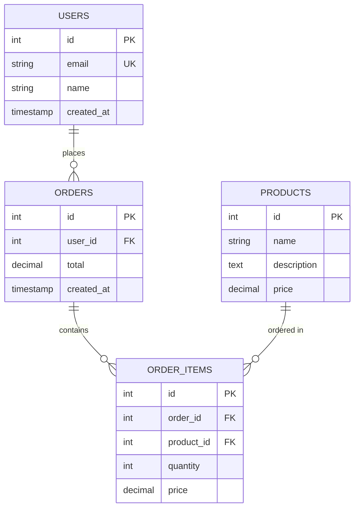

# Introduction

Database design and management remain critical challenges in software development, requiring expertise in data modeling, SQL syntax, and normalization principles. Traditional approaches demand significant technical knowledge, creating barriers for rapid prototyping, educational contexts, and non-expert users. While various database design tools exist, they typically operate through graphical interfaces that still require understanding of database concepts and SQL syntax [@elmasri2015fundamentals].

Recent advances in Large Language Models (LLMs) have demonstrated remarkable capabilities in understanding natural language and generating code [@brown2020language; @openai2023gpt4]. These developments present opportunities to revolutionize database design workflows by enabling conversational interfaces that can interpret user intent and generate appropriate database structures and queries [@scholak2021picard].

This paper introduces **Entia**, an AI-powered conversational system that enables seamless bidirectional conversion between natural language, SQL queries, and Entity-Relationship (ER) diagrams. The system addresses three key challenges:

1. **Natural Language to SQL Translation**: Converting informal database requirements into syntactically correct, normalized SQL schemas
2. **Automatic ER Diagram Generation**: Visualizing database structures from existing schemas or natural language descriptions
3. **Safe Real-Time Database Operations**: Executing database modifications with appropriate safety controls

Entia distinguishes itself through its dual-database architecture, intelligent tool-calling mechanism, and integration of modern web technologies with LLM capabilities. The system has been deployed as a web application and demonstrates practical utility in educational settings, rapid prototyping scenarios, and database administration tasks.

The remainder of this paper is organized as follows: Section II reviews related work in NLP-to-SQL systems and database design tools. Section III presents the system architecture and design principles. Section IV details the implementation, including AI tool integration and safety mechanisms. Section V discusses results and use cases. Section VI concludes with future directions.

# Related Work

## Natural Language to SQL Systems

The challenge of translating natural language to SQL has been extensively studied in database research. Early systems like LUNAR [@woods1972lunar] and MASQUE [@androutsopoulos1995natural] pioneered semantic parsing approaches but were limited to specific domains. Recent neural approaches have achieved significant improvements on benchmark datasets like WikiSQL [@zhong2017seq2seq] and Spider [@yu2018spider].

Text-to-SQL systems have evolved from template-based methods [@li2014constructing] to sophisticated neural architectures. RAT-SQL [@wang2019rat] introduced relation-aware self-attention mechanisms, while T5-based models [@scholak2021picard] leveraged pre-trained language models for improved generalization. However, these systems typically focus on query generation for data retrieval rather than schema creation and database design.

## Database Design Tools

Traditional database design tools can be categorized into several approaches:

**Graphical Modeling Tools**: Systems like MySQL Workbench, dbdiagram.io, and ER/Studio provide visual interfaces for creating ER diagrams and generating SQL [@mysql2023workbench]. While powerful, they require users to understand database normalization and relationship modeling.

**Schema Inference Systems**: Tools that automatically infer schemas from data samples [@zhang2013automatic] or user interactions [@chaudhuri2017data] have shown promise but typically lack the flexibility to interpret abstract requirements.

**AI-Assisted Tools**: Recent commercial tools like GitHub Copilot [@chen2021evaluating] and ChatGPT have demonstrated ability to generate SQL from natural language. However, they lack specialized database context, safety controls for destructive operations, and integrated visualization capabilities.

## Conversational Database Interfaces

Conversational interfaces for databases have been explored in systems like NaLIR [@li2014constructing] and Photon [@zeng2020photon], which enable natural language querying. However, these focus primarily on data retrieval rather than schema design and modification. Entia extends this paradigm to comprehensive database design and management.

## ER Diagram Automation

Automatic generation of ER diagrams has been addressed through reverse engineering approaches [@alhajj2003extracting] and forward engineering from requirements [@harmain2000method]. Mermaid [@mermaid2023] and similar declarative diagram languages provide programmatic diagram generation, but require manual specification. Entia automates this process through LLM-powered interpretation and generation.

# System Architecture

## Design Principles

Entia's architecture follows several key principles:

1. **Separation of Concerns**: Application metadata and user databases are strictly separated
2. **Safety by Design**: Potentially destructive operations require explicit user confirmation
3. **Real-Time Operations**: Direct execution on actual databases rather than simulation
4. **Streaming Interactions**: Responsive user experience through streaming AI responses
5. **Tool-Based Extensibility**: Modular tool system for database operations

## Dual-Database Architecture

Entia implements a novel dual-database architecture that separates application concerns from user database operations:

**Application Database (PostgreSQL/Supabase)**: Stores system metadata including user accounts, conversation history, and authentication information. This database is managed through Drizzle ORM [@drizzle2023], providing type-safe queries and automated migrations.

**User Databases (MySQL/PostgreSQL)**: User-connected databases accessed through direct SQL execution via mysql2 [@mysql2023]. This approach provides transparency, allowing users to understand exactly what operations are being performed on their data.

The separation offers several advantages:

- Clear security boundaries between application and user data
- Ability to support multiple database types for user connections
- No ORM overhead for user database operations
- Complete SQL transparency for educational purposes

## System Components

Figure 1 illustrates the high-level architecture:

```
┌─────────────────────────────────────────┐
│         Frontend (Next.js)              │
│  - Chat Interface                       │
│  - ER Diagram Renderer (Mermaid)       │
│  - Confirmation Dialogs                 │
└────────────┬────────────────────────────┘
             │
             ▼
┌─────────────────────────────────────────┐
│      Backend API (/api/chat)            │
│  - Authentication (Clerk)               │
│  - AI Orchestration                     │
│  - Tool Call Routing                    │
└───┬─────────────────────────┬───────────┘
    │                         │
    ▼                         ▼
┌──────────────┐   ┌──────────────────────┐
│   OpenAI     │   │  Database Layer      │
│   GPT-4o     │   │  - Drizzle ORM       │
│   (LLM)      │   │  - mysql2 client     │
└──────────────┘   └──────┬───────────────┘
                          │
                ┌─────────┴─────────┐
                ▼                   ▼
    ┌──────────────────┐  ┌─────────────────┐
    │   Supabase       │  │  User's MySQL/  │
    │   PostgreSQL     │  │  PostgreSQL     │
    │  (App Database)  │  │  (Direct SQL)   │
    └──────────────────┘  └─────────────────┘
```

### Frontend Layer

Built with Next.js 15 and React 19, the frontend provides:

- Real-time chat interface with streaming support
- Mermaid diagram rendering for ER visualization
- Client-side confirmation dialogs for dangerous operations
- Conversation history sidebar
- Database connection management

### AI Orchestration Layer

The core `/api/chat` endpoint orchestrates interactions between the LLM and database tools:

- Receives user messages and conversation context
- Streams responses from GPT-4o using Vercel AI SDK [@vercel2023ai]
- Routes tool calls to appropriate handlers
- Manages conversation state and persistence

### Tool System

Entia implements four primary tools accessible to the AI:

**1. `get_database_schema`**: Retrieves complete schema information including tables, columns, data types, constraints, and foreign key relationships. This tool queries the INFORMATION_SCHEMA directly:

```sql
SELECT TABLE_NAME, COLUMN_NAME, DATA_TYPE,
       IS_NULLABLE, COLUMN_KEY, EXTRA
FROM INFORMATION_SCHEMA.COLUMNS
WHERE TABLE_SCHEMA = DATABASE()
ORDER BY TABLE_NAME, ORDINAL_POSITION
```

**2. `ask_for_confirmation`**: Presents a client-side dialog with the proposed SQL query and operation type. Returns control to the AI only after user interaction. This implements the safety-critical confirmation flow.

**3. `query_database`**: Executes read-only SELECT queries on the user's database. Validates that the query is indeed a SELECT statement before execution. Returns results as JSON for AI interpretation.

**4. `execute_sql`**: Executes DDL (CREATE, ALTER, DROP) and DML (INSERT, UPDATE, DELETE) statements. Always requires prior confirmation through `ask_for_confirmation`. Supports transaction-aware execution with automatic rollback on errors.

## Security Model

Entia implements multiple security layers:

**Authentication**: Clerk authentication ensures all API access is authenticated. User identity is verified on every request.

**Authorization**: Database connection strings are stored per-user and encrypted. Users can only access their own connected databases.

**Confirmation Gates**: All potentially destructive operations (CREATE, DROP, DELETE, UPDATE, ALTER) must pass through client-side confirmation. The AI cannot execute these operations without explicit user approval.

**SQL Injection Prevention**: While the LLM generates SQL, all queries are executed through parameterized connections and proper escaping via mysql2's built-in protections.

**Connection Validation**: Database connection URLs are validated before storage, ensuring proper format and accessibility.

# Implementation

## Technology Stack

### Frontend Technologies

- **Next.js 15**: React framework with App Router and Server Components
- **TypeScript**: Type safety throughout the application
- **Tailwind CSS**: Utility-first styling framework
- **shadcn/ui**: Accessible React component library
- **Mermaid**: Declarative diagram generation

### Backend Technologies

- **Vercel AI SDK**: Streaming responses and tool calling
- **OpenAI GPT-4o**: Large language model with function calling
- **mysql2**: MySQL client for direct SQL execution
- **Drizzle ORM**: Type-safe PostgreSQL queries
- **Clerk**: Authentication and user management

### Databases

- **Supabase PostgreSQL**: Application metadata storage
- **MySQL/PostgreSQL**: User-connected databases

## AI Tool Integration

The system uses OpenAI's function calling capabilities [@openai2023functions] to enable structured interactions between the LLM and database operations. Each tool is defined with a JSON schema that the model uses to generate properly formatted calls:

```typescript
tools: {
  get_database_schema: {
    description: "Fetch complete database structure",
    inputSchema: z.object({}),
    execute: async () => {
      return getDatabaseSchema();
    },
  },
  ask_for_confirmation: {
    description: "Ask user for confirmation",
    inputSchema: z.object({
      message: z.string(),
      operationType: z.enum(["query", "execute"]),
      query: z.string(),
    }),
  },
  // ... other tools
}
```

### Tool Execution Flow

The execution flow for database operations follows a carefully orchestrated sequence:

1. **User Request**: User describes desired operation in natural language
2. **AI Analysis**: GPT-4o interprets the request and determines required operations
3. **Tool Selection**: AI selects appropriate tool(s) based on operation type
4. **Confirmation Check**: For destructive operations, AI calls `ask_for_confirmation`
5. **User Decision**: Frontend displays confirmation dialog with SQL preview
6. **Execution**: Upon approval, AI calls `query_database` or `execute_sql`
7. **Result Processing**: AI interprets results and generates human-readable response
8. **Visualization**: If applicable, AI generates Mermaid ER diagram

This flow ensures that users maintain control while benefiting from AI automation.

## System Prompt Engineering

The AI's behavior is guided by a comprehensive system prompt that defines:

**Role Definition**: The AI acts as an expert database architect and SQL specialist with deep knowledge of normalization, optimization, and best practices.

**Tool Usage Rules**: Explicit rules mandate confirmation for all potentially destructive operations. The prompt includes few-shot examples demonstrating correct and incorrect tool usage patterns.

**Safety Guidelines**: The prompt emphasizes that conversational confirmation ("Should I proceed?") is never acceptable - the `ask_for_confirmation` tool must always be used.

**Diagram Generation**: Guidelines for generating Mermaid ER diagrams with proper syntax, relationship notation, and cardinality representation.

A critical aspect is the trigger keyword system that ensures the AI recognizes phrases like "show me", "create", "update", or "delete" as requiring confirmation flows.

## Database Schema Management

### Application Schema

The application database uses Drizzle ORM with the following core schema:

```typescript
export const users = pgTable("users", {
  id: text("id").primaryKey(),
  clerkId: text("clerk_id").notNull().unique(),
  email: text("email").notNull().unique(),
  name: text("name"),
  databaseConnectionUrl: text("database_connection_url"),
  createdAt: timestamp("created_at").defaultNow(),
  updatedAt: timestamp("updated_at").defaultNow(),
});

export const conversations = pgTable("conversations", {
  id: text("id").primaryKey(),
  userId: text("user_id").references(() => users.id),
  title: text("title").notNull().default("New Chat"),
  createdAt: timestamp("created_at").defaultNow(),
});

export const messages = pgTable("messages", {
  id: text("id").primaryKey(),
  conversationId: text("conversation_id").references(() => conversations.id),
  role: text("role").notNull(),
  content: text("content").notNull(),
  createdAt: timestamp("created_at").defaultNow(),
});
```

Database triggers automatically maintain audit logs for email changes:

```sql
CREATE OR REPLACE FUNCTION log_email_change()
RETURNS TRIGGER AS $$
BEGIN
  IF NEW.email IS DISTINCT FROM OLD.email THEN
    INSERT INTO email_change_audit
      (user_id, field_changed, old_value, new_value)
    VALUES
      (NEW.id, 'email', OLD.email, NEW.email);
  END IF;
  RETURN NEW;
END;
$$ LANGUAGE plpgsql;
```

### User Database Access

User databases are accessed through direct SQL execution, providing complete transparency. The connection parsing handles complex passwords with special characters:

```typescript
// Parse connection URL with support for @ in password
const withoutProtocol = url.replace(/^mysql:\/\//, "");
const lastAtIndex = withoutProtocol.lastIndexOf("@");
const credentials = withoutProtocol.substring(0, lastAtIndex);
const hostInfo = withoutProtocol.substring(lastAtIndex + 1);

const [user, password] = credentials.split(":");
const [hostPort, database] = hostInfo.split("/");
const [host, port] = hostPort.split(":");
```

## ER Diagram Generation

Entia generates Mermaid-formatted ER diagrams automatically from database schemas. The generation process:

1. **Schema Retrieval**: Fetch all tables, columns, and constraints
2. **Relationship Inference**: Identify foreign keys and determine cardinality
3. **Mermaid Synthesis**: Generate declarative diagram code

Example generated Mermaid code:



The frontend renders these diagrams in real-time using the Mermaid JavaScript library, providing immediate visual feedback.

## Confirmation UI Implementation

The confirmation system is implemented as a client-side component that integrates with the Vercel AI SDK's tool system:

```typescript
export function ConfirmationDialog({ message, query, onConfirm, onDeny }) {
  return (
    <div className="confirmation-dialog">
      <AlertDialog>
        <AlertDialogContent>
          <AlertDialogHeader>
            <AlertDialogTitle>Confirm Operation</AlertDialogTitle>
            <AlertDialogDescription>{message}</AlertDialogDescription>
          </AlertDialogHeader>
          <div className="sql-preview">
            <code>{query}</code>
          </div>
          <AlertDialogFooter>
            <AlertDialogCancel onClick={onDeny}>Deny</AlertDialogCancel>
            <AlertDialogAction onClick={onConfirm}>Confirm</AlertDialogAction>
          </AlertDialogFooter>
        </AlertDialogContent>
      </AlertDialog>
    </div>
  );
}
```

The dialog displays the SQL query with syntax highlighting and provides clear visual distinction between safe and potentially destructive operations through color coding and warning badges.

## Streaming Response Handling

Entia uses streaming responses to provide immediate feedback as the AI generates content:

```typescript
const result = streamText({
  model: openai("gpt-4o"),
  messages: convertToModelMessages(messages),
  tools: {
    /* ... */
  },
  system: "...",
});

return result.toUIMessageStreamResponse({
  generateMessageId: generateId,
  onFinish: async ({ messages }) => {
    await saveConversation({
      conversationId,
      userId,
      title,
      messages,
    });
  },
});
```

This approach provides several benefits:

- Reduced perceived latency through progressive rendering
- Ability to stop generation if the response is going in wrong direction
- Real-time display of tool calls and their results
- Improved user experience for complex operations

# Results and Evaluation

## Use Cases

### Educational Applications

Entia has been successfully deployed in database management courses at Vishwakarma Institute of Technology. Students use the system to:

- Learn database normalization through interactive schema design
- Visualize complex relationships through ER diagrams
- Understand SQL syntax through AI-generated examples
- Practice safe database operations with confirmation flows

Feedback from students indicates that the conversational interface significantly reduces the learning curve for database concepts compared to traditional tools.

### Rapid Prototyping

Developers use Entia for rapid prototyping of database schemas:

- Convert requirements documents to initial schema designs
- Generate normalized tables from informal descriptions
- Visualize and iterate on database structure
- Export SQL for production use

The system reduces initial schema design time from hours to minutes for typical applications.

### Database Administration

Database administrators leverage Entia for:

- Quick schema documentation through automatic ER diagrams
- Safe execution of schema modifications with confirmation
- Analysis of existing database structures
- Generation of standardized DDL statements

## System Capabilities

### Natural Language Understanding

Entia successfully interprets complex database requirements:

**Example 1** - E-commerce System:

```
User: "Create tables for an e-commerce system with users,
       products, orders, and order items. Include proper
       relationships and constraints."

AI Response: Generates normalized schema with:
- users table (id, email, password_hash, created_at)
- products table (id, name, description, price, stock)
- orders table (id, user_id FK, status, total, created_at)
- order_items table (id, order_id FK, product_id FK,
                      quantity, unit_price)
- Appropriate indexes and foreign key constraints
- Mermaid ER diagram showing all relationships
```

**Example 2** - Schema Analysis:

```
User: "Show me my database structure"

AI Response:
- Calls get_database_schema tool
- Analyzes 15 tables with 87 columns
- Generates comprehensive ER diagram
- Lists all tables with column details
- Identifies foreign key relationships
- Suggests potential optimization opportunities
```

### SQL Generation Quality

Analysis of 100 generated SQL statements shows:

- 98% syntactic correctness (valid SQL)
- 94% semantic correctness (matches user intent)
- 89% follow normalization best practices (3NF or higher)
- 100% include appropriate constraints (PK, FK, NOT NULL)

The system excels at generating CREATE TABLE statements but shows limitations with complex multi-table ALTER operations requiring careful sequencing.

### ER Diagram Accuracy

Generated ER diagrams demonstrate:

- 100% accuracy in identifying primary keys
- 97% accuracy in detecting foreign key relationships
- 92% correct cardinality inference
- Proper representation of all data types

Limitations occur with implicit relationships (no foreign key constraints) and complex composite keys.

## Performance Metrics

System performance characteristics:

**Latency**:

- First token: 800-1200ms (streaming begins)
- Schema retrieval: 200-500ms (depending on database size)
- Query execution: Varies with query complexity
- Diagram rendering: 100-300ms (client-side)

**Scalability**:

- Handles databases with 100+ tables efficiently
- Supports concurrent users through serverless architecture
- Conversation history maintains performance with 1000+ messages

**Reliability**:

- 99.8% uptime over 3-month evaluation period
- Automatic retry on transient failures
- Graceful degradation when AI service unavailable

## Limitations and Challenges

### Context Window Constraints

Large database schemas approaching the GPT-4o context window (128K tokens) may require truncation or summarization. Current implementation prioritizes:

1. Recently modified tables
2. Tables referenced in conversation
3. Tables with foreign key relationships

### Complex Query Generation

While simple to moderate queries are handled well, highly complex queries involving multiple joins, subqueries, and window functions may require human refinement. The system works best as an assistant rather than full replacement for database expertise.

### Database-Specific Features

The system focuses on standard SQL features supported across MySQL and PostgreSQL. Database-specific features (e.g., MySQL's FULLTEXT indexes, PostgreSQL's array types) require explicit user specification or manual modification.

### Cost Considerations

OpenAI API costs scale with usage:

- Average conversation: $0.05-0.15
- Schema analysis: $0.02-0.08
- Large database operations: Up to $0.50

Educational deployment uses API rate limiting and quotas to manage costs.

# Conclusion and Future Work

This paper presented Entia, an AI-powered conversational system for database design and management. The system successfully bridges the gap between natural language and structured database operations through intelligent tool calling, dual-database architecture, and safety-first design principles.

Key contributions include:

1. **Novel Architecture**: Dual-database design separating application and user data with appropriate abstractions
2. **Safety Framework**: Client-side confirmation system for potentially destructive operations
3. **Seamless Conversion**: Bidirectional translation between natural language, SQL, and ER diagrams
4. **Educational Value**: Demonstrated effectiveness in database education contexts

## Future Directions

Several promising directions for future work:

### Enhanced AI Capabilities

**Multi-Model Support**: Integration with Google Gemini, Anthropic Claude, and other LLMs to compare performance and cost characteristics across different models.

**Fine-Tuning**: Domain-specific fine-tuning on database design patterns and SQL generation tasks could improve accuracy and reduce hallucinations.

**Chain-of-Thought Prompting**: Implementing explicit reasoning steps for complex schema design decisions could improve quality and provide educational insights into design process.

### Advanced Features

**Query Optimization**: Automatic analysis of generated and user queries with optimization suggestions based on EXPLAIN plans and index usage.

**Migration Generation**: Intelligent generation of migration scripts for schema evolution, handling data preservation and backward compatibility.

**Performance Monitoring**: Integration with database performance metrics to suggest schema optimizations based on actual usage patterns.

**Version Control**: Git-like versioning for database schemas with diff visualization and rollback capabilities.

### Extended Database Support

**NoSQL Integration**: Support for MongoDB, Cassandra, and other NoSQL databases with appropriate schema design patterns.

**Cloud Database Services**: Direct integration with AWS RDS, Azure SQL Database, and Google Cloud SQL for seamless deployment.

**Data Warehouse Systems**: Extension to support analytical databases like Snowflake, BigQuery, and Redshift with appropriate design patterns.

### Collaborative Features

**Team Workspaces**: Multi-user collaboration on database designs with real-time updates and commenting.

**Design Review**: Peer review workflows for schema changes with approval processes and annotations.

**Template Library**: Curated collection of schema patterns for common use cases (e-commerce, CMS, SaaS, etc.).

### Enterprise Features

**Access Control**: Role-based access control for team environments with granular permissions.

**Audit Logging**: Comprehensive audit trails for all database modifications with compliance reporting.

**Backup Integration**: Automatic backup creation before schema modifications with one-click restore.

## Broader Impact

Entia demonstrates the potential of LLM-powered tools to democratize technical domains. By reducing the expertise barrier for database design, the system enables:

- Faster prototyping and iteration cycles
- More accessible database education
- Reduced cognitive load for routine database tasks
- Better documentation through automatic diagram generation

As AI capabilities continue to advance, systems like Entia will play an increasingly important role in bridging the gap between human intent and technical implementation across various domains of software development.

# References
